# Atheryon Data Modeller Architecture

```mermaid
graph TB
    %% Project Header
    subgraph Project ["PROJECT: Atheryon Data Modeller - MXML to ISDA CDM Transformation Platform"]
        direction TB
        
        %% External Layer
        subgraph External ["External Systems"]
            Client[Client Applications]
            LegacySystems[Legacy Trading Systems<br/>MXML Sources]
            ISDACDMRepo[ISDA CDM Repository<br/>Standards Compliance]
        end

        %% API Gateway Layer
        subgraph Gateway ["API Gateway Layer"]
            APIM[Azure API Management<br/>Optional]
        end

        %% Code Repositories
        subgraph CodeRepos ["Code Repositories"]
            MainRepo["🔗 atheryon-data-modeller<br/>Main Transformation Platform"]
            RosettaDSL["🔗 rosetta-dsl<br/>ISDA CDM Code Generation"]
            InfraRepo["🔗 infrastructure-bicep<br/>Azure IaC Templates"]
            ConfigRepo["🔗 configuration<br/>App Settings and Configs"]
        end

        %% Main Resource Group
        subgraph RG ["rg-atheryon-data-modeller-prod"]
            direction TB
            
            subgraph AppLayer ["Application Layer"]
                FunctionApp[cdmfunction<br/>Azure Functions<br/>📁 /azure-functions]
                WebApp[cdmwebapp<br/>Flask Web Interface<br/>📁 /webapp]
                CDMService[Spring Boot CDM Service<br/>Java REST API<br/>📁 /cdm-service]
                AppPlan[cdmAppPlan<br/>App Service Plan<br/>📁 /infra/MVP]
            end

            subgraph ProcessingLayer ["Processing Layer"]
                TransformEngine[MXML to CDM Transformer<br/>Python Engine<br/>📁 /transform/mxml_to_cdm.py]
                AgentTools[Trade Query Agent<br/>AI Powered Search<br/>📁 /azure-functions/search_trades_by_field]
                RosettaGen[Rosetta Code Generator<br/>Multi Language Support<br/>📁 /rosetta-dsl]
            end

            subgraph DataLayer ["Data Layer"]
                SQLServer[cdmsql<br/>SQL Server Database<br/>📁 /infra/MVP]
                StorageAccount[cdmstorage<br/>Azure Storage<br/>📁 /infra/MVP]
                CanonicalStore[Canonical Trade Store<br/>CDM JSON Records<br/>📁 /canonical_store/trades]
                SampleData[Sample MXML Data<br/>Test Trade Files<br/>📁 /sample_data]
            end

            subgraph SecurityLayer ["Security & Secrets"]
                KeyVault[cdm-kv<br/>Key Vault<br/>📁 /infra/MVP]
                ManagedIdentity[Managed Identity<br/>Zero Secret Authentication<br/>📁 /infra/MVP]
            end

            subgraph MonitoringLayer ["Monitoring & Observability"]
                AppInsights[cdm-insights<br/>Application Insights<br/>📁 /infra/MVP]
                LogAnalytics[cdm-logs<br/>Log Analytics Workspace<br/>📁 /infra/MVP]
            end

            subgraph TestingLayer ["Testing Infrastructure"]
                TestSuite[Python Test Suite<br/>Transform Validation<br/>📁 /tests]
                AgentTests[Agent Query Tests<br/>Trade Search Validation<br/>📁 /azure-functions/search_trades_by_field/agent/tools]
            end
        end
    end

    %% Code to Component Links
    MainRepo -.-> TransformEngine
    MainRepo -.-> FunctionApp
    MainRepo -.-> WebApp
    MainRepo -.-> AgentTools
    
    RosettaDSL -.-> RosettaGen
    RosettaDSL -.-> CDMService
    
    InfraRepo -.-> AppPlan
    InfraRepo -.-> SQLServer
    InfraRepo -.-> StorageAccount
    InfraRepo -.-> KeyVault
    InfraRepo -.-> ManagedIdentity
    InfraRepo -.-> AppInsights
    InfraRepo -.-> LogAnalytics
    
    ConfigRepo -.-> FunctionApp
    ConfigRepo -.-> WebApp
    ConfigRepo -.-> CDMService

    %% External Data Flow
    LegacySystems --> TransformEngine
    ISDACDMRepo --> RosettaGen
    Client --> APIM

    %% API Flow
    APIM --> WebApp
    APIM --> CDMService
    APIM --> FunctionApp

    %% Data Transformation Flow
    TransformEngine --> CanonicalStore
    SampleData --> TransformEngine
    CanonicalStore --> SQLServer
    CanonicalStore --> StorageAccount

    %% Agent Processing Flow
    AgentTools --> CanonicalStore
    WebApp --> AgentTools
    FunctionApp --> AgentTools

    %% CDM Service Integration
    CDMService --> SQLServer
    CDMService --> StorageAccount
    RosettaGen --> CDMService

    %% Application Dependencies
    FunctionApp --> KeyVault
    FunctionApp --> AppInsights
    FunctionApp -.-> AppPlan
    
    WebApp --> KeyVault
    WebApp --> AppInsights
    WebApp -.-> AppPlan
    
    CDMService --> KeyVault
    CDMService --> AppInsights
    CDMService -.-> AppPlan

    %% Security Integration
    KeyVault --> ManagedIdentity
    FunctionApp --> ManagedIdentity
    WebApp --> ManagedIdentity
    CDMService --> ManagedIdentity
    SQLServer --> ManagedIdentity
    StorageAccount --> ManagedIdentity

    %% Testing Integration
    TestSuite --> TransformEngine
    TestSuite --> CanonicalStore
    AgentTests --> AgentTools
    AgentTests --> CanonicalStore

    %% Monitoring Data Flow
    AppInsights --> LogAnalytics
    KeyVault -.-> LogAnalytics
    SQLServer -.-> LogAnalytics
    StorageAccount -.-> LogAnalytics
    FunctionApp -.-> LogAnalytics
    WebApp -.-> LogAnalytics
    CDMService -.-> LogAnalytics

    %% Styling with high contrast colors
    classDef functionApp fill:#0277bd,stroke:#01579b,stroke-width:2px,color:#ffffff
    classDef aiService fill:#7b1fa2,stroke:#4a148c,stroke-width:2px,color:#ffffff
    classDef storage fill:#388e3c,stroke:#1b5e20,stroke-width:2px,color:#ffffff
    classDef security fill:#f57c00,stroke:#e65100,stroke-width:2px,color:#ffffff
    classDef monitoring fill:#c2185b,stroke:#880e4f,stroke-width:2px,color:#ffffff
    classDef container fill:#1976d2,stroke:#0d47a1,stroke-width:2px,color:#ffffff
    classDef codeRepo fill:#424242,stroke:#212121,stroke-width:2px,color:#ffffff
    classDef external fill:#607d8b,stroke:#37474f,stroke-width:2px,color:#ffffff

    class FunctionApp,WebApp,CDMService,AppPlan functionApp
    class TransformEngine,AgentTools,RosettaGen aiService
    class SQLServer,StorageAccount,CanonicalStore,SampleData storage
    class KeyVault,ManagedIdentity security
    class AppInsights,LogAnalytics,TestSuite,AgentTests monitoring
    class MainRepo,RosettaDSL,InfraRepo,ConfigRepo codeRepo
    class Client,LegacySystems,ISDACDMRepo,APIM external
```

## Architecture Overview

This diagram shows the complete architecture for the **Atheryon Data Modeller** project - an MXML to ISDA CDM Transformation Platform that includes:

### Key Components:
- **MXML to CDM Transformer**: Python-based engine for converting legacy MXML trade files to standardized ISDA CDM format
- **Azure Functions**: Serverless compute for trade search operations with AI-powered agent capabilities
- **Flask Web Interface**: User-friendly web application for trade data exploration and transformation
- **Spring Boot CDM Service**: Enterprise Java REST API for CDM data access and manipulation
- **Rosetta Code Generator**: Multi-language code generation supporting DAML, Python, Java, Scala, TypeScript, and JSON Schema
- **Canonical Trade Store**: Standardized CDM JSON records with complete audit trail
- **Testing Infrastructure**: Comprehensive validation for transformation accuracy and agent functionality

### Code Repository Structure:
- **atheryon-data-modeller**: Main platform with transformation engines, Azure Functions, and web interface
- **rosetta-dsl**: ISDA CDM code generation toolkit with multi-language support
- **infrastructure-bicep**: Azure resource provisioning with Infrastructure as Code
- **configuration**: Application settings, environment variables, and deployment configurations

### Data Flow:
1. **Data Ingestion**: Legacy MXML trade files imported from trading systems
2. **Transformation Pipeline**: Python engine converts MXML to standardized CDM JSON format
3. **Canonical Storage**: Transformed trades stored in both SQL Server and Azure Storage
4. **AI-Powered Search**: Agent-based query processing with natural language capabilities
5. **Multi-Channel Access**: Web interface, REST API, and Azure Functions provide flexible access
6. **Code Generation**: Rosetta DSL generates implementation code for various platforms

### Security Model:
- **Managed Identity**: Zero-secret authentication across all Azure services
- **Key Vault Integration**: Secure storage for connection strings and API keys
- **Role-Based Access**: Fine-grained permissions for different user types
- **Audit Trail**: Complete logging of all transformation and access operations

### CDM-Specific Features:
- **ISDA Compliance**: Full adherence to Common Domain Model standards
- **Multi-Entity Support**: Party, Product, and Trade entity management
- **Data Validation**: Schema validation ensuring CDM compliance
- **Interoperability**: Standardized format enables cross-institution data exchange
- **Regulatory Ready**: Supports compliance reporting requirements
- **Version Management**: Tracks CDM schema versions and migration paths

### Business Value:
- **Data Standardization**: Converts proprietary formats to industry standards
- **Operational Efficiency**: Automated transformation reduces manual effort
- **Regulatory Compliance**: Ensures adherence to financial industry standards
- **Cost Optimization**: Serverless architecture optimizes operational costs
- **Scalability**: Cloud-native design supports enterprise-scale processing
- **Integration Ready**: Standard APIs enable seamless system integration

This architecture provides a comprehensive foundation for financial data transformation with enterprise-grade security, monitoring, and ISDA CDM compliance.